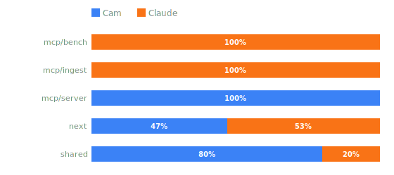

# june.

A unified developer knowledge platform. Not a chatbot, not a search engine — a knowledge interface that uses natural language as its input method.

> "It doesn't do the work for you. It empowers you to do the work faster."

june makes a developer feel like a senior engineer on a codebase they've never touched.

---

## AI usage disclosure

<!-- authorship-stats-start -->
_source: 52 commits · 29,070 lines written (excludes READMEs and .claude docs)_

| | Cam | Claude |
|--|--:|--:|
| Commits | 46 (88%) | 6 (12%) |
| Lines written | 16,585 (57%) | 12,485 (43%) |


<!-- authorship-stats-end -->

This project is built with significant AI assistance via [Claude Code](https://claude.ai/code) (Anthropic). To be transparent about that, an authorship-tracking system is active throughout the repository. [→ How it works](#how-it-works)

---

## What it is

june indexes your internal docs, vendor APIs, and codebases into a single queryable knowledge base running entirely on local hardware. No data leaves the building.

The founding technical bet:

> **If the RAG is elite, the model is almost irrelevant.**

Every engineering decision flows from this. The goal isn't to run GPT-4 — it's to make the context window so clean and precise that a cheap local model (Gemma 26b, Ollama) has no choice but to give a correct answer.

**Four query modes:**
- **Search** — pure ranked results, no AI
- **Quick** — fast answer, tight retrieval, one paragraph
- **SME** — comprehension first: entities, relationships, operations, gotchas — before any detail
- **Conversational** — socratic, user-driven, june removes friction

**The UI is not a chatbot.** It's a knowledge interface — command bar entry, subject line as thread anchor, sources always visible and clickable, history as a log.

**Self-hosted, self-sufficient:**
- Runs on prosumer hardware
- Vector search via Qdrant
- Embeddings via Ollama (nomic-embed-text or jina-v2-base-code)
- SQLite sidecar for ingestion provenance
- No cloud dependency — HIPAA, legal, finance, defense viable

**Full synopsis:** [`.claude/synopsis.md`](.claude/synopsis.md)

---

## Monorepo layout

```
june/
  packages/
    next/       — @june/next        Next.js 16 frontend
    shared/     — @june/shared      shared types, env/config/logger scaffolding
    mcp/
      ingest/   — @june/mcp-ingest  markdown ingestion pipeline + june CLI
      bench/    — @june/mcp-bench   synthetic-corpus RAG-quality eval (june-eval CLI)
      server/   — @june/mcp-server  MCP JSON-RPC server (scaffold)
```

Bun workspace root. All packages are TypeScript strict, `"type": "module"`, Bun runtime.

---

## How it works

There are two complementary tracking mechanisms.

**Git history (primary)** — the most honest and immutable record. Every commit where Claude wrote the majority of the code carries a `Co-authored-by: Claude <claude@anthropic.com>` trailer. The pre-commit hook reads the full `git log --numstat` to count lines inserted in Claude co-authored commits vs Cam commits, and updates the table above on every commit. This is the authoritative number.

A post-tool-use hook records Claude's per-file line contributions to `.claude/scratch/authorship.jsonl`. Before any commit, the script `scripts/check-authorship.sh` produces a per-file breakdown:

```
file                          claude_adds  total_lines  pct
packages/mcp/ingest/src/...   142          198          71%  ← Claude-primary
scripts/check-authorship.sh   0            44           0%   ← Cam-primary
```

Files where Claude contributed more than 50% of lines since the last commit are **Claude-primary** and carry the co-author trailer. Files at 50% or below are **Cam-primary** and have no trailer. When a single commit contains both groups, it is split so attribution is accurate at the file level.

**Per-file ownership (secondary)** — every source file carries an `// author: <name>` comment. The pre-commit hook tallies these by package to produce the bar chart above. If Claude's session contribution to a file crosses 50%, the hook flips the comment from `// author: Cam` to `// author: Claude` automatically. This is a useful distribution view but a coarser metric than the git history line counts.

### Why

AI-assisted development is increasingly normal. This system exists to make the extent of that assistance legible — in the git log, not just in a disclaimer. If you read the history, you can see exactly which parts Claude wrote.
